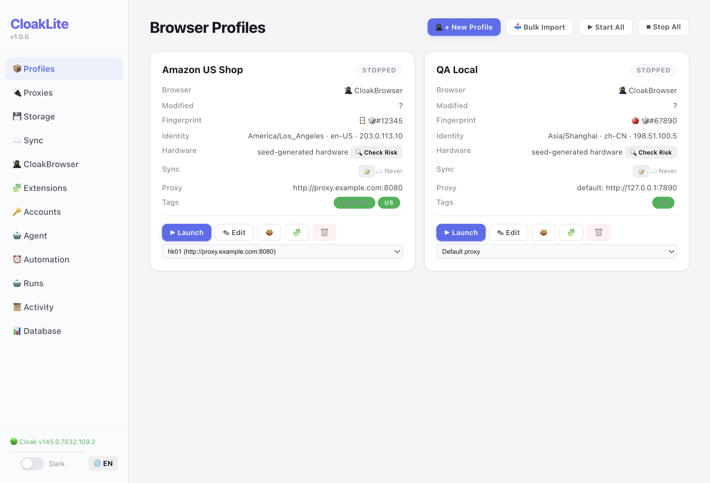
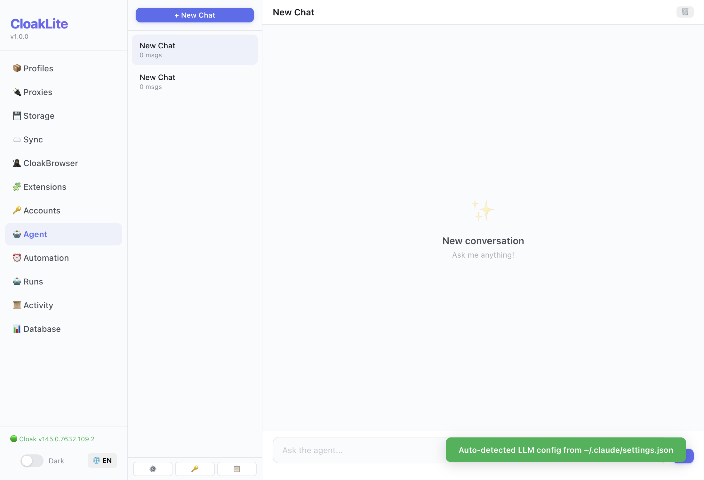
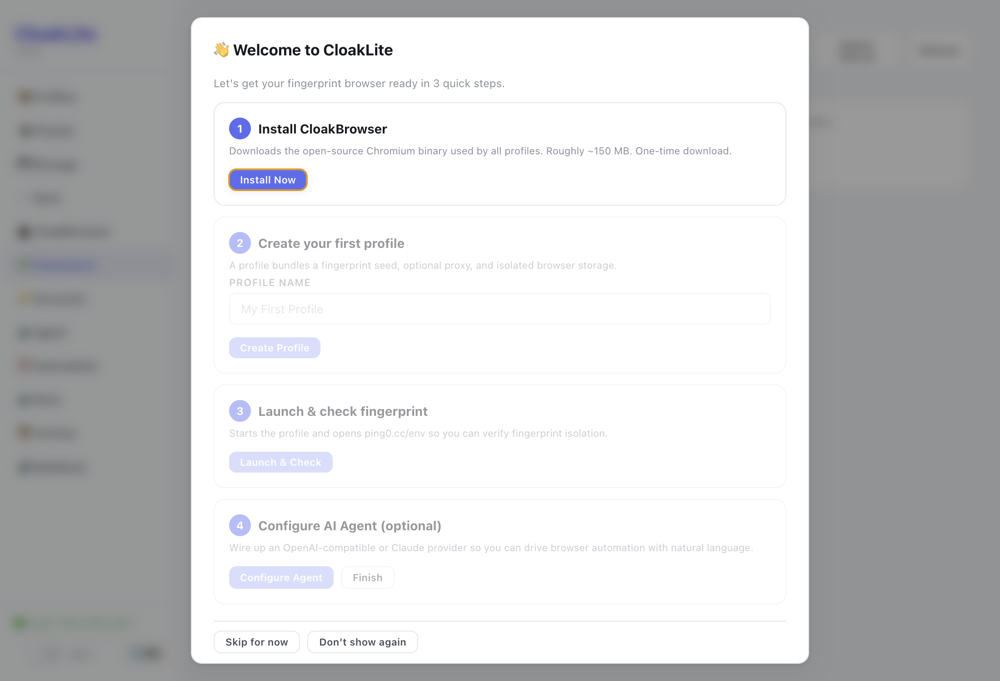
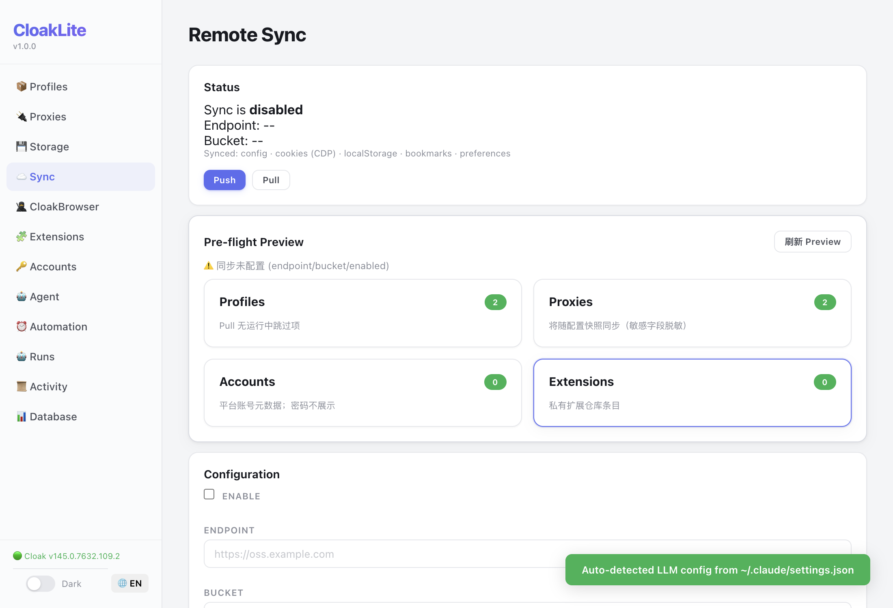
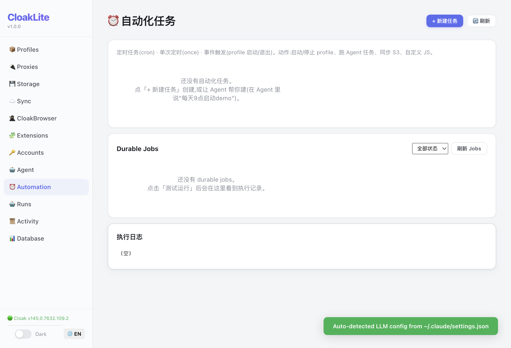
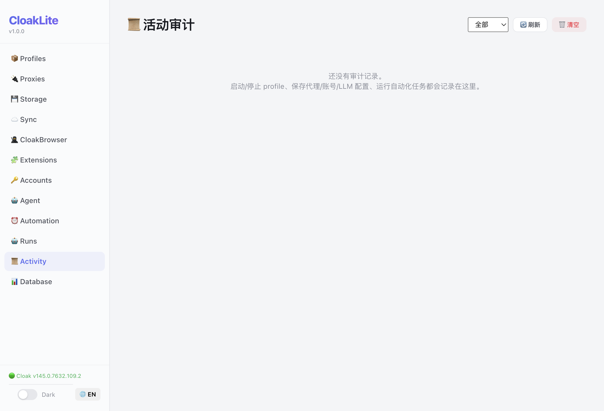
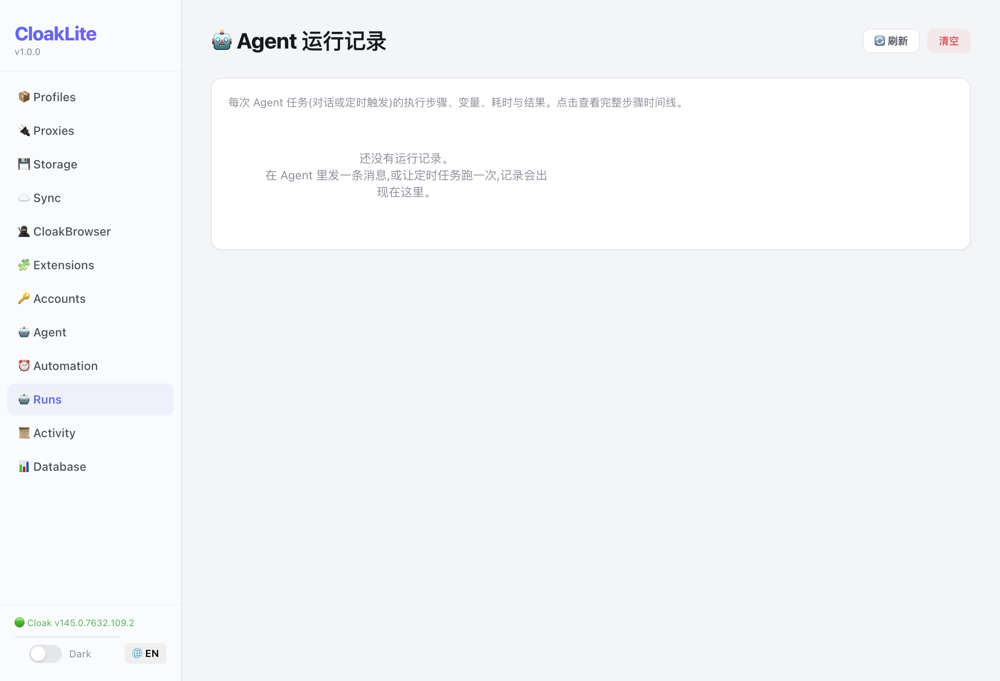
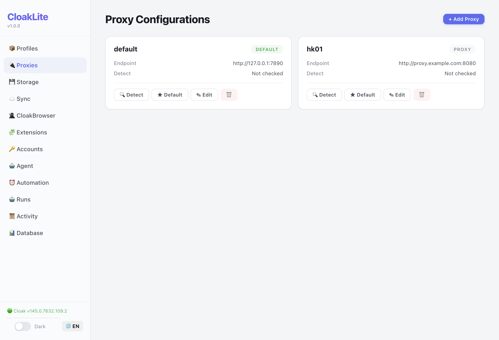

# CloakLite

> Local-first browser profile management and AI automation console for CloakBrowser.

CloakLite helps authorized teams manage CloakBrowser profiles, proxies, browser state, AI-assisted workflows, durable automation jobs, audit traces, and S3-compatible sync from a self-hosted Electron desktop app.

**Languages:** [English](README.md) | [简体中文](README.zh-CN.md)  
**User Guide:** [English](docs/USER_GUIDE.en.md) | [简体中文](docs/USER_GUIDE.zh-CN.md)

---

## Important Notice

CloakLite is a dual-use local automation tool. Use it only for lawful, authorized workflows such as QA, localization testing, privacy-preserving personal workflows, authorized business operations, and defensive research.

Do **not** use CloakLite for fraud, spam, credential attacks, unauthorized scraping, platform abuse, ban evasion, fake identity networks, or misuse of cookies, credentials, personal data, or confidential information. See [ACCEPTABLE_USE.md](ACCEPTABLE_USE.md).

---

## Features

| Area | Capabilities |
|---|---|
| CloakBrowser profiles | Install/configure CloakBrowser, create/launch/stop profiles, deterministic fingerprint seeds, profile tags |
| Fingerprint settings | Platform, timezone, locale, WebRTC, GPU, screen, CPU, memory, storage quota, fonts |
| Proxy management | Named HTTP/SOCKS proxies, credentials redaction, per-profile assignment, proxy geo detection |
| Browser state | Cookies, localStorage, preferences, bookmarks, extension state, storage inspection |
| Extension repository | Local ZIP/CRX import, Chrome Web Store package cache, safe extraction, sync hash verification |
| AI Agent | OpenAI-compatible and Claude providers, tool calling, browser control, file/HTTP/DB tools, run traces |
| Skills and templates | Built-in skills, import/exportable recipes, task templates, platform adapters |
| Automation | Scheduled/manual rules, durable jobs, job/run linkage, automation job UI |
| Sync | S3-compatible config/profile artifact sync with preview, bounded reads, restore hardening |
| Audit/export | Activity timeline, run traces, redacted export bundles, cross-object links |
| Security hardening | Renderer sandbox, context isolation, CSP, approval gates, SSRF blocking, redaction boundaries |

---

## Screenshots

| Profiles | Agent |
|---|---|
|  |  |
| **Wizard** | **Sync** |
|  |  |
| **Automation** | **Activity** |
|  |  |
| **Runs** | **Proxy** |
|  |  |

---

## Quick Start

### Requirements

- macOS on Apple Silicon
- Node.js 22.16 or newer
- npm

### Install and run

```bash
git clone https://github.com/edgora-ai/browser-manger.git
cd browser-manger
npm install
npm start
```

### Development checks

```bash
npm run build
npm test
```

Targeted E2E examples:

```bash
npm run build
npx vitest run -c vitest.config.e2e.ts tests/e2e/j34-credential-vault.test.ts
```

> E2E runs generate local browser data under `tests/e2e/userdata/`; this directory is ignored and must not be committed.

---

## First-Run Workflow

1. Open **CloakBrowser** and install/configure the CloakBrowser binary.
2. Open **Profiles** and create a profile.
3. Optional: open **Proxies**, add a proxy, and assign it to the profile.
4. Launch the profile and run **Check Risk** / consistency checks.
5. Optional: open **Agent**, configure an LLM provider, and run an authorized browser automation task.
6. Optional: open **Automation** to create scheduled or manual rules.
7. Optional: configure **Sync** only after reviewing the privacy and security notes.

See the full [English User Guide](docs/USER_GUIDE.en.md) or [中文使用手册](docs/USER_GUIDE.zh-CN.md).

---

## Project Structure

```text
src/
  main/
    index.ts              Electron entry, window, tray, MCP bootstrap
    preload.cjs           contextBridge API
    ipc/                  IPC handler modules
    services/             business logic and persistence
    types.ts              shared interfaces
  renderer/
    index.html            UI shell
    css/                  renderer styles
    js/                   modular renderer application
tests/
  unit/                   service and hardening tests
  e2e/                    Playwright Electron journeys
  smoke/                  structural checks
docs/                     user guides and roadmap
patches/                  reserved (Chromium patches are not included in this repo)
resources/                app icons
```

---

## Security, Privacy, and Compliance

CloakLite handles sensitive local data, including browser profile state, cookies, localStorage, proxy credentials, LLM API keys, sync credentials, audit logs, screenshots, and agent traces.

Security controls include:

- Electron renderer sandbox, context isolation, and no Node integration in the renderer
- CSP with self-hosted scripts
- local config permissions and atomic writes
- secret redaction in IPC, UI, export, sync-safe config, and run trace views
- approval gates for HTTP write methods and destructive DB operations
- local/private/link-local/CGNAT blocking for agent HTTP requests
- bounded HTTP/LLM response handling
- safe ZIP/CRX extraction and extension package hash verification
- loopback-only MCP server with bearer-token authentication

Read before use:

- [SECURITY.md](SECURITY.md)
- [PRIVACY.md](PRIVACY.md)
- [ACCEPTABLE_USE.md](ACCEPTABLE_USE.md)
- [NOTICE.md](NOTICE.md)

---

## Known Limitations

| Area | Current state |
|---|---|
| Platform support | macOS on Apple Silicon is supported out of the box. Windows/Linux cross-platform code paths exist but are not yet fully verified end-to-end. |
| i18n | zh-CN and en-US are supported with runtime switching. The core UI, sidebar, wizard, and tray are translated; some generated strings in Automation/Runs/Activity/DB/Approval still fall back to Chinese. |
| Agent chat streaming | Live token streaming is supported for OpenAI-compatible and Claude providers. Tool-call metadata is emitted after each tool-call block completes; tool execution blocks the next streaming round. |
| Onboarding wizard | A 4-step first-run wizard (install binary → create profile → launch + risk check → optional AI config) appears when no binary or profiles exist. |
| Renderer architecture | The renderer is modular vanilla JS loaded by script tags; it is not bundled. Some modules remain large and rely on a shared global namespace. |
| E2E tests | Unit/smoke tests run in CI. E2E (Playwright Electron) journeys require a real Electron environment and a CloakBrowser binary, so they are not all run in CI yet. |

---

## Testing and Release Checklist

Before publishing or sharing a build:

```bash
npm run build
npm test
npm audit --json
```

Recommended repository hygiene checks:

```bash
rg -n --hidden --glob '!node_modules/**' --glob '!dist/**' --glob '!.git/**' 'sk-|AKIA|BEGIN .*PRIVATE KEY|github_pat_|ghp_' . || true
git status --short --ignored
```

Do not commit:

- `.env` or local config files
- sqlite/db files
- Cookies, Local Storage, Session Storage
- audit logs, screenshots, exported bundles
- `dist/`, `node_modules/`, E2E userdata

---

## Documentation

- [User Guide — English](docs/USER_GUIDE.en.md)
- [使用手册 — 简体中文](docs/USER_GUIDE.zh-CN.md)
- [Improvement Roadmap](docs/improvement-roadmap.md)
- [Contributing](CONTRIBUTING.md)
- [Security Policy](SECURITY.md)
- [Privacy Notice](PRIVACY.md)
- [Acceptable Use Policy](ACCEPTABLE_USE.md)

---

## Contributing

Contributions are welcome. Please read [CONTRIBUTING.md](CONTRIBUTING.md) and include tests for security-sensitive or persistence-related changes.

---

## License

MIT — see [LICENSE](LICENSE).

---

## Trademarks and Non-Affiliation

CloakLite is not affiliated with, endorsed by, sponsored by, or officially connected to Google, Chrome, Chromium, Meta, Facebook, Instagram, TikTok, Amazon, Shopee, OpenAI, Anthropic, AWS, S3-compatible storage providers, or CloakBrowser unless explicitly stated by those parties.
